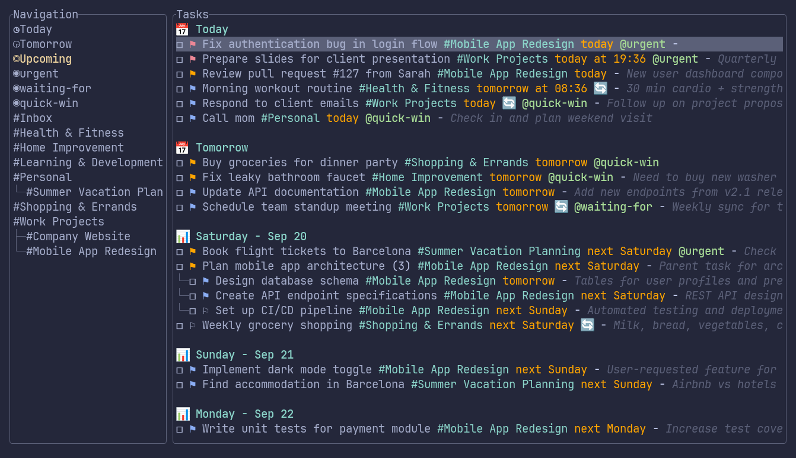
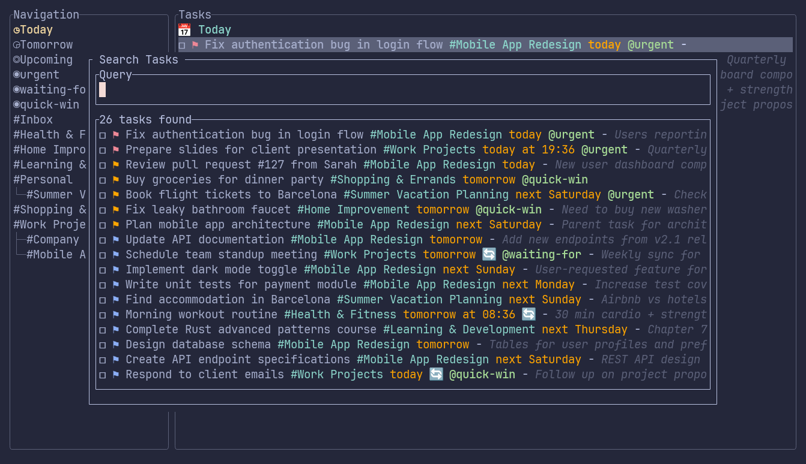

# Terminalist - Todoist Terminal Client

[](https://www.rust-lang.org)
[](https://github.com/romaintb/terminalist/actions)
[](https://crates.io/crates/terminalist)
[](LICENSE)
[](https://github.com/romaintb/terminalist)
[](https://developer.todoist.com)

**📖 Documentation:** [Configuration](docs/CONFIGURATION.md) | [Keyboard Shortcuts](docs/KEYBOARD_SHORTCUTS.md) | [Development](docs/DEVELOPMENT.md) | [Architecture](docs/ARCHITECTURE.md)

A terminal application for interacting with Todoist, built in Rust with a modern TUI interface.

 

## Features

- ✅ **Interactive TUI Interface** - Beautiful terminal user interface with ratatui
- ✅ **Local Data Caching** - Fast, responsive UI with in-memory SQLite storage
- ✅ **Smart Sync** - Automatic sync on startup and manual refresh with 'r'
- ✅ **Project Management** - Browse projects with hierarchical display
- ✅ **Task Management** - View, navigate, complete, and create tasks
- ✅ **Task Search** - Fast database-powered search across all tasks with '/' shortcut
- ✅ **Keyboard & Mouse Navigation** - Efficient keyboard operation with mouse support
- ✅ **Real-time Updates** - Create, complete, and delete tasks/projects
- ✅ **Label Support** - View task labels with colored badges
- ✅ **Responsive Layout** - Adapts to terminal size with smart scaling
- ✅ **Help System** - Built-in help panel with keyboard shortcuts
- ✅ **Configuration File** - Customizable settings via TOML configuration

## Installation

[](https://repology.org/project/terminalist/versions)

### Option 1: Install from Homebrew (macOS & Linux)

```bash
brew tap romaintb/terminalist
brew install terminalist
```

### Option 2: Install from AUR (Arch Linux)

```bash
# Using yay
yay -S terminalist

# Using paru
paru -S terminalist

# Or any other AUR helper
```

### Option 3: Install from Crates.io

```bash
cargo install terminalist
```

### Option 4: Build from Source

```bash
# Clone the repository
git clone https://github.com/romaintb/terminalist.git
cd terminalist

# Build the project
cargo build --release

# Run the application
cargo run --release
```

The binary will be available at `target/release/terminalist` after building.

### Help Wanted: Package Maintainers

We support Homebrew for installation! For other distributions (Debian/Ubuntu, Fedora, NixOS, etc.), we're looking for help packaging Terminalist. If you're interested in maintaining a package, please open an issue or submit a PR!

## Setup

### 1. Get your Todoist API Token

1. Go to [Todoist Integrations Settings](https://todoist.com/prefs/integrations)
2. Find the "API token" section
3. Copy your API token

### 2. Set Environment Variable

```bash
export TODOIST_API_TOKEN=your_token_here
```

### 3. (Optional) Generate Configuration File

```bash
# Generate a default config file with all available options
terminalist --generate-config
```

This creates a config file at `~/.config/terminalist/config.toml` with customizable settings.

### 4. Run the Application

```bash
terminalist
```

## Configuration

Terminalist supports customization via TOML configuration files.

```bash
# Generate a default config file with all available options
terminalist --generate-config
```

This creates a config file at `~/.config/terminalist/config.toml`.

📖 **See [Configuration Guide](docs/CONFIGURATION.md) for detailed configuration options.**

## Quick Start Controls

Essential keyboard shortcuts to get started:

| Key | Action |
|-----|--------|
| `j/k` | Navigate tasks up/down |
| `J/K` | Navigate projects up/down |
| `Space` | Complete task |
| `a` | Create new task |
| `/` | Search tasks |
| `b` | Toggle sidebar |
| `r` | Sync with Todoist |
| `?` | Show help panel |
| `q` | Quit |

📖 **See [Complete Keyboard Shortcuts](docs/KEYBOARD_SHORTCUTS.md) for all available controls and interface details.**

## How It Works

Terminalist uses a smart sync mechanism:
- **Fast Startup**: In-memory SQLite database for instant loading
- **Auto Sync**: Syncs with Todoist on startup and every 5 minutes
- **Manual Sync**: Press `r` to force refresh from Todoist
- **Real-time Updates**: Create, modify, and delete tasks/projects immediately

📖 **See [Architecture Guide](docs/ARCHITECTURE.md) for technical details.**

## Contributing

Contributions are welcome! See [Development Guide](docs/DEVELOPMENT.md) for setup instructions and coding standards.

## License

This project is open source. Feel free to modify and use as needed.
